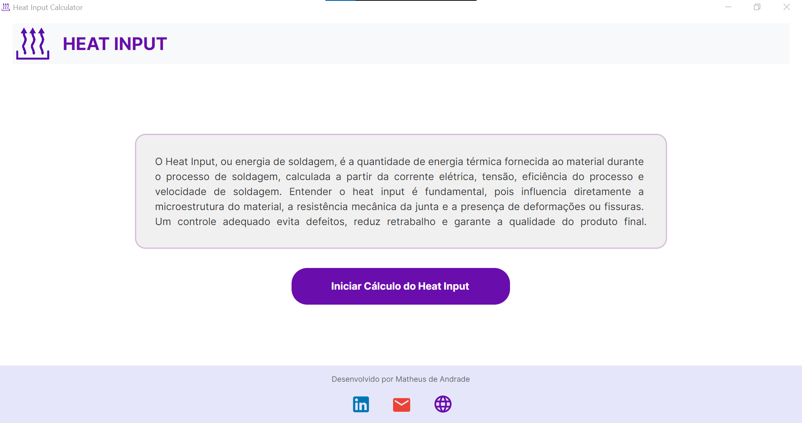
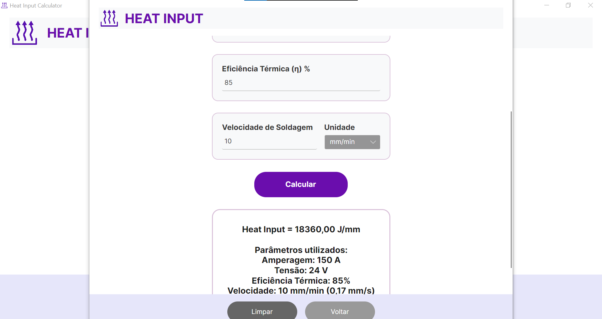

# Heat Input Calculator
Aplicação desktop desenvolvida em C# para auxiliar no cálculo de **Heat Input** em processos de soldagem. O foco do projeto é oferecer uma ferramenta simples, direta e **totalmente offline**, voltada para estudantes, soldadores, tecnólogos, inspetores e engenheiros.

---
## 🌐 Download do Aplicativo
O instalador pode ser baixado diretamente pelo site oficial do projeto:

👉 **https://drillweld.netlify.app/**

---

## 🔥 O que é Heat Input?
O **Heat Input** representa a quantidade de energia térmica transferida para o material durante a soldagem. Esse valor influencia diretamente a qualidade da junta soldada, afetando microestrutura, propriedades mecânicas e a ocorrência de defeitos. O cálculo é feito a partir dos seguintes parâmetros:

- **Amperagem (I)**
- **Tensão (V)**
- **Eficiência térmica (η)**
- **Velocidade de soldagem**, com suporte às unidades:
  - cm/s  
  - cm/min  
  - mm/s  
  - mm/min  

Um controle adequado do Heat Input ajuda a evitar problemas como trincas, deformações excessivas e perda de propriedades mecânicas.

---

## 📷 Interface do Aplicativo

### Tela inicial

### Tela de cálculo

---

## ⚙️ Funcionalidades

- Inserção simples dos parâmetros de soldagem  
- Conversão automática das unidades de velocidade  
- Cálculo do Heat Input em **J/mm**  
- Interface desktop moderna e leve  
- Funcionamento **100% offline**  
- Aplicação **multiplataforma (desktop)**  

---

## 🛠️ Tecnologias utilizadas

- C#
- .NET
- Avalonia UI

---

## 👤 Autor

**Matheus de Andrade**  
📧 E-mail: matheus014ndrade@gmail.com  
🔗 LinkedIn: https://www.linkedin.com/in/matheus-andrade-4449212b7

---

## 📄 Licença

Este projeto é voltado para uso educacional e profissional.  
Sinta-se à vontade para estudar, adaptar e contribuir.
